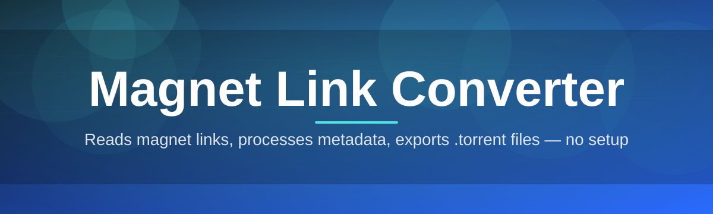
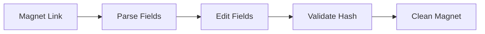

# magnet-link-editor 🧲✨

  

*Turn messy magnet links into clean, shareable, trackable data — in one click.*

  

## 🌍 Overview

Magnet links are one of the most elegant ideas in decentralized file-sharing, but the raw string itself is a hostile piece of text — a wall of URL-encoded trackers, hashes, and display names crammed into a single line that no human wants to read. **magnet-link-editor** exists to sit between you and that wall of text, decoding it, letting you edit it, and handing back something clean, correct, and ready to use.

This project was born out of a simple frustration: every time a tracker list went stale, or a display name got mangled by encoding, there was no good desktop tool to just *open, fix, and export* a magnet URI without pasting it into three different web forms. So we built one. It's a Windows-native, standalone Magnet Link Converter and editor that treats your magnet links as structured data — info hash, display name, trackers, and extra params — instead of an opaque blob.

Whether you're a digital archivist maintaining torrent metadata, a developer testing peer-to-peer tooling, or just someone who wants to tidy up a magnet URI before sharing it, this tool is built for you. It runs entirely offline, keeps your data on your machine, and is small enough to live on a USB stick.

## 🚀 Get It Now

> [!TIP]
> First time here? The landing page above has the latest build plus a short changelog — always grab from there rather than an old link floating around.

---

## 🔥 What Makes It Shine

- **Instant Magnet Parsing** — drop in any magnet link and watch it explode into readable fields: info hash, display name (`dn`), trackers (`tr`), and exact length (`xl`) — no manual regex, no guesswork.

- **Batch Tracker Cleanup** — select dozens of magnet links at once and strip dead trackers, deduplicate entries, or inject a fresh curated tracker list across the whole batch in seconds.

- **Live Link Reconstruction** — every edit you make rebuilds the magnet URI in real time, so what you see in the preview pane is exactly what gets copied or exported.

- **Hash Validation Engine** — automatically flags malformed or truncated info hashes (both v1 SHA-1 and v2 BTMH formats) before you waste time sharing a broken link.

- **Multi-Format Export** — save your cleaned-up links as `.txt`, `.csv`, or `.json`, ready to feed into scripts, spreadsheets, or your own automation pipeline.

- **Drag-and-Drop Import** — pull magnet links straight from `.torrent` metadata files or plain text lists without touching the clipboard.

- **Diff View for Edits** — compare the original magnet link against your edited version side-by-side so you always know exactly what changed.

- **Portable, Zero-Install Footprint** — a single executable, no registry writes, no background services — close it and it's like it was never there.

> [!NOTE]
> All parsing and editing happens locally in memory. Nothing is uploaded, logged, or phoned home — this is a Magnet Link Converter, not a tracking service.

---

## 🧭 How To Get Started

1. Visit the landing page using the download button above.

2. Grab the latest standalone build — it's a single portable executable, nothing else to fetch.

3. Run the executable directly; Windows may show a SmartScreen prompt on first launch since the app is unsigned by a large vendor — click **More Info → Run Anyway**.

4. Paste or drag in your first magnet link and start editing — no setup wizard, no account, no configuration file required.

> [!IMPORTANT]
> Because the app is portable, keep it in a folder you control. Running it from a temp/download folder that gets auto-cleaned will wipe your saved presets.

---

## 💻 System Requirements

| Component | Minimum | Recommended |
|---|---|---|
| **OS** | Windows 10 (64-bit) | Windows 11 (64-bit) |
| **RAM** | 512 MB free | 2 GB free |
| **Disk** | 50 MB free space | 150 MB free space |

  

There are no external dependencies to install — the Magnet Link Converter ships as a fully self-contained executable, so what you download is what you run.

---

## ⚙️ How It Works

Under the hood, the editor treats every magnet link as a small pipeline rather than a single string:

1. **Ingest** — the raw magnet URI (or `.torrent` file) is read and split into its URL-encoded components.

2. **Parse** — each component (info hash, display name, trackers, params) is decoded into a structured, editable model.

3. **Edit** — you modify fields through the UI; the internal model updates instantly.

4. **Validate** — the hash validation engine checks structural integrity before rebuild.

5. **Rebuild & Export** — a clean magnet URI is re-encoded and made available to copy, save, or batch-export.

---

## 🛟 Troubleshooting

<strong>My magnet link shows "invalid hash" — why?</strong>

This usually means the info hash was truncated or corrupted before it reached the tool — often from copy-pasting only part of the string. Re-copy the full magnet URI from the original source and re-import.

<strong>The tracker list I imported didn't apply to all selected links.</strong>

Batch tracker injection only applies to links currently checked in the list view. Double-check the checkbox column — it's easy to miss one row when scrolling a long batch.

<strong>Windows SmartScreen is blocking the app from running.</strong>

This is expected for a small independent tool without a costly code-signing certificate. Click **More Info → Run Anyway** — the executable is unmodified from what's published on the landing page.

<strong>Can I convert a .torrent file into a magnet link?</strong>

Yes — drag the `.torrent` file onto the import zone and the converter extracts the info hash and trackers automatically to build a valid magnet URI.

<strong>Why does the display name show odd characters?</strong>

That's typically an encoding mismatch in the original magnet link (non-UTF-8 display names). Use the **Re-decode As** option in the edit panel to try alternate encodings.

---

## 🎨 UI, UX & Personalization

The interface is deliberately minimal — one main pane for parsing, one side panel for batch actions — so nothing gets in the way of the actual editing.

**Keyboard Shortcuts**

| Action | Shortcut |
|---|---|
| Paste & Parse | `Ctrl + V` |
| Copy Cleaned Link | `Ctrl + C` |
| New Batch | `Ctrl + N` |
| Export | `Ctrl + E` |
| Toggle Diff View | `Ctrl + D` |

- **Themes** — Light, Dark, and a low-glare "Archive" theme tuned for long editing sessions.

- **Settings** — persisted locally, including your default tracker list, preferred export format, and last-used folder.

> [!WARNING]
> Resetting settings clears saved tracker presets permanently. Export your presets first if you've spent time curating a tracker list.

---

## 🤝 Contributing & Community

This project thrives because of contributors who care about clean, honest tooling for the torrent ecosystem. Whether you fix a typo, squash a parsing edge case, or add a whole new export format — it matters.

- Check the **good first issue** label if you're new here — these are scoped to be approachable and well-documented.

- Open an issue before large changes so we can discuss direction together.

- PRs with tests and a short description of *why* the change matters get reviewed fastest.

> [!TIP]
> Not a developer? You can still help enormously by improving documentation, reporting confusing UX, or triaging issues.

---

## 📄 License

Released under the [MIT License](LICENSE), 2026.

---

## ⚠️ Disclaimer

magnet-link-editor is a general-purpose Magnet Link Converter and editing utility. It does not host, distribute, or index any content — it simply parses and reformats magnet URIs that you provide. Users are solely responsible for ensuring their use of magnet links complies with applicable laws in their jurisdiction.

---

